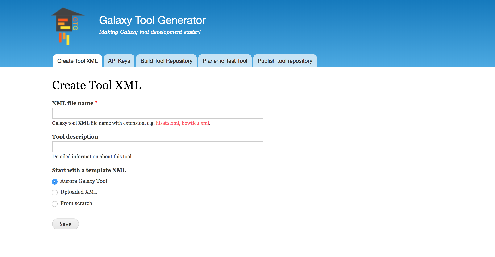
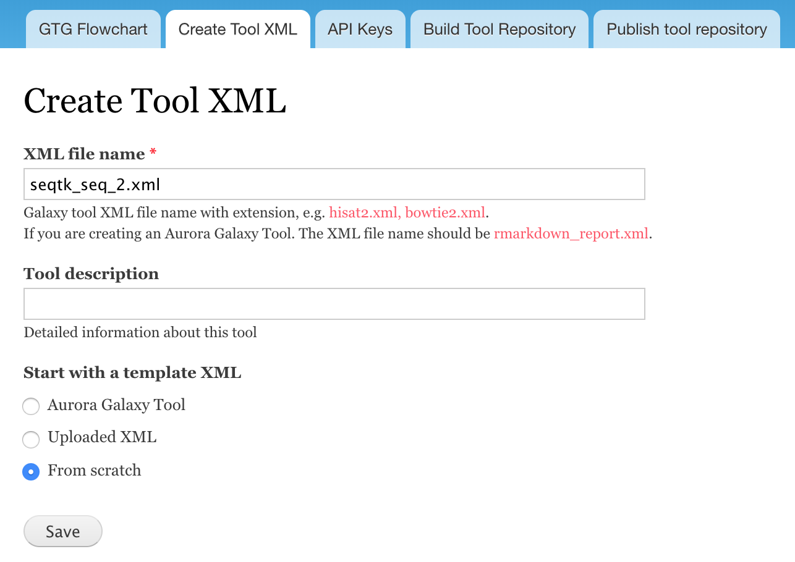

# Docker Galaxy Tool Generator

This docker image can be used to launch a Galaxy Tool Generator (GTG) for developing Galaxy
tools through web interfaces.


 
To get necessary docker images:

```
docker pull mingchen0919/gtgdocker
docker pull bgruening/galaxy-stable:17.09
```

## Launch GTG

```
wget https://raw.githubusercontent.com/MingChen0919/gtgdocker/master/launch_dev_env.sh
sh launch_dev_env.sh
```

This script will launch a docker container running the GTG app and another container running
a Galaxy instance. Login to the Galaxy instance with username **admin** and password **admin**
so that you can install tools from tool shed.

After running this script, you should see the following directories in your current directory:

```
gtg_dev_dir/
├── database
├── galaxy_tool_repository
└── shed_tools
```

## Build Tool XML

GTG provides three ways to build a Galaxy XML file:

* Aurora Galaxy Tool: this option starts with an template file for developing an Aurora Galaxy Tool.
* Uploaded XML: starts with an uploaded XML.
* From scratch: builds XML from scratch.


### Start from scratch

In this example we are going to use GTG to build this [seqtk_seq_2.xml](https://raw.githubusercontent.com/MingChen0919/gtgdocker/master/seqtk_seq_2.xml) file.


0. initialize an XML

* Click **Create Tool XML**
* Enter `seqtk_seq_2.xml` into **XML file name**
* Select **From scratch** and click **Save**




1. create **tool** component, which is the root component.

```
<tool id="seqtk_seq" name="Convert to FASTA (seqtk)" version="0.1.0">
```


