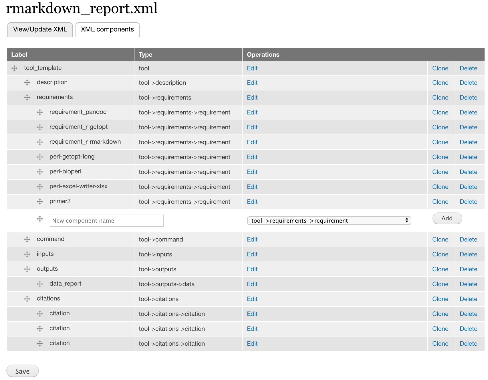

# Launch GTG and Galaxy

Get a copy of `launch_dev_env.sh` to your local computer

```
wget https://raw.githubusercontent.com/MingChen0919/gtgdocker/master/launch_dev_env.sh
```

Run `launch_dev_env.sh`

```
sh launch_dev_env.sh
```

This will start the GTG app, a Galaxy instance, and creates a workspace with three folders within it.

```
gtg_dev_dir
├── database
├── galaxy_tool_repository
└── shed_tools
```

# Create initial XML

We will wrap `findSSRs_altered.pl` as an Aurora Galaxy Tool. 

* Click **Create Tool XML** and Fill the **XML file name** field with `rmarkdown_report.xml`
* Select Aurora Galaxy Tool and click **Save**


# Add components to XML

## Add requirement components

This tool require the following dependencies. We create a requirement component for each of these four components.



