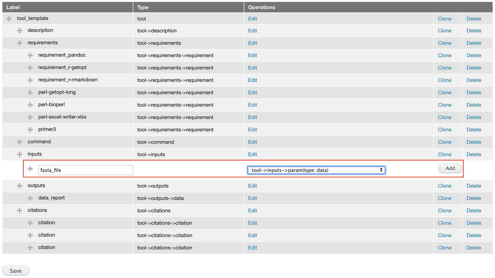
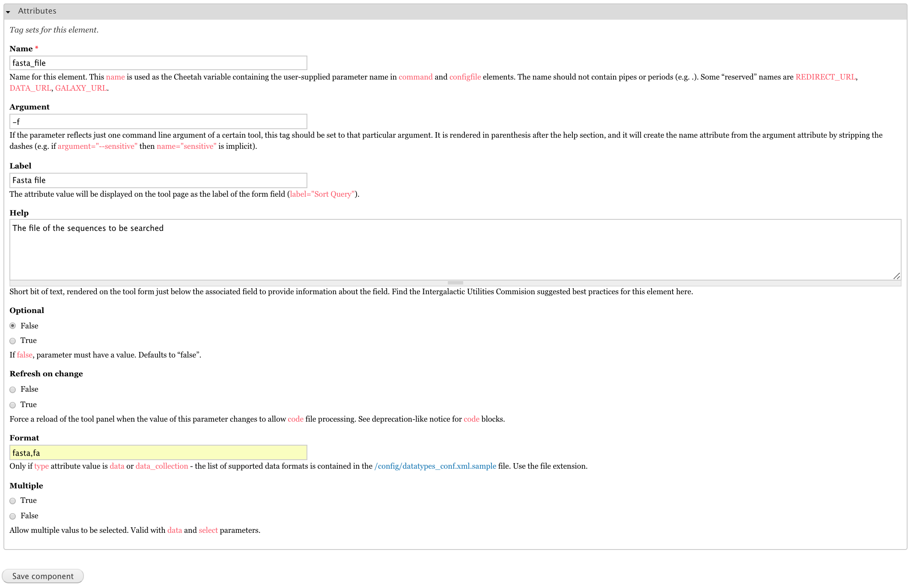
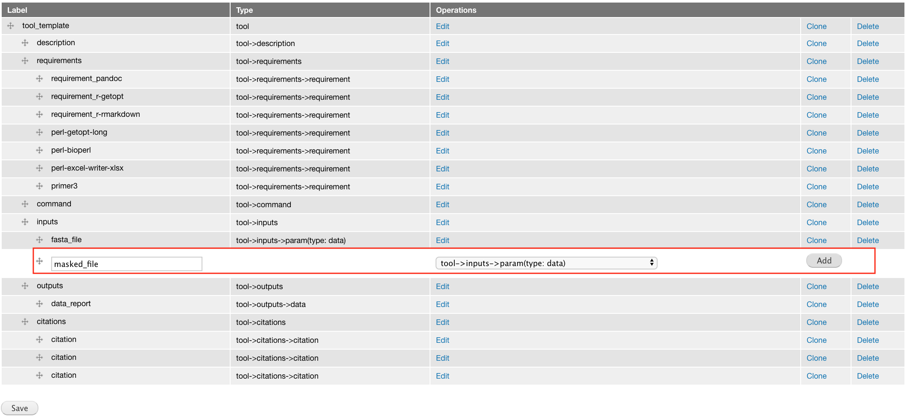
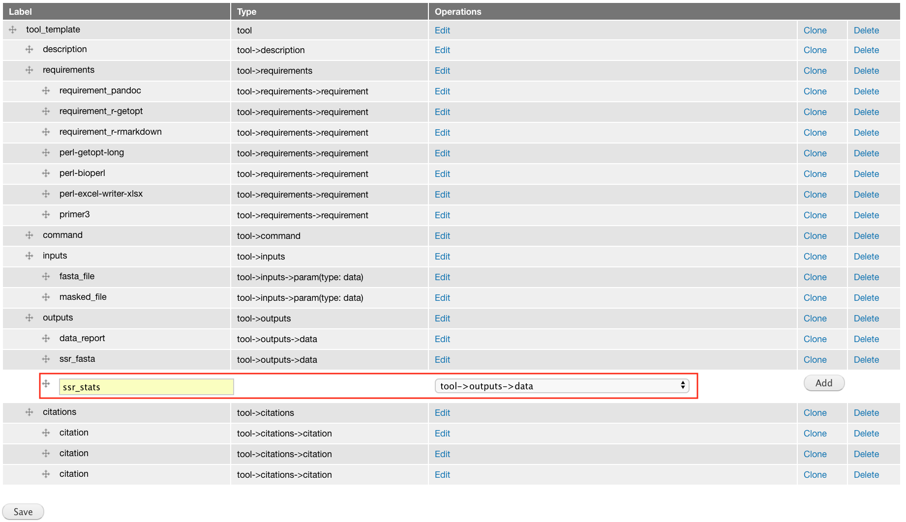
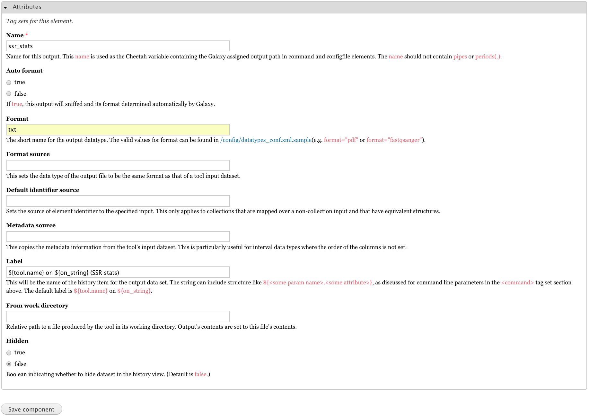

# The tool: Find-SRRs

The Find-SRRs tool is a perl script which can be found here: https://raw.githubusercontent.com/statonlab/Finding-SSRs/master/findSSRs_altered.pl.

# Launch GTG and Galaxy

Get a copy of `launch_dev_env.sh` to your local computer

```
wget https://raw.githubusercontent.com/MingChen0919/gtgdocker/master/launch_dev_env.sh
```

Run `launch_dev_env.sh`

```
sh launch_dev_env.sh
```

This will start the GTG app, a Galaxy instance, and creates a workspace with three folders within it.

```
gtg_dev_dir
├── database
├── galaxy_tool_repository
└── shed_tools
```

# Create initial XML

We will wrap `findSSRs_altered.pl` as an Aurora Galaxy Tool. 

* Click **Create Tool XML** and Fill the **XML file name** field with `rmarkdown_report.xml`
* Select Aurora Galaxy Tool and click **Save**


# Add components to XML

## Add requirement components

This tool requires three perl modules - Getopt::Long, Bio::SeqIO, and Excel::Writer::XLSX - as well as Primer3. We create requirement component for each of these four components. We can find the dependencies and their version numbers in [bioconda](https://anaconda.org/bioconda/repo).

* perl-getopt-long (2.50)
* perl-bioperl (1.7.2)
* perl-excel-writer-xlsx (0.98)
* primer3 (2.4.1a)


## Add input components

The `Find SRRs` only has two inputs. We create input component for each.

```
# Usage: findSSRs.pl <arguments>
#
# The list of arguments includes:
#
# -f|--fasta_file <fasta_file>
# Required.  The file of the sequences to be searched.
#
# -m|--masked_file <masked_fasta_file>
# Required.  A soft-masked version of the fasta file (soft masked means low
# complexity sequences are in lower case bases.)
```

### The `fasta_file` input

Add a **tool->inputs->param(type: data)** component because this input takes a file path.



Edit input attributes




### The `masked_file` input

Add a **tool->inputs->param(type: data)** component because this input takes a file path.



Edit input attributes


## Add output components

Since we are building an Aurora Galaxy Tool, the tool report will provide access to all tool outputs. However,
if we want to expose some outputs to the Galaxy history so that it can be used as inputs for other tools, we will
need to create output components for those outputs.

Below is what this program outputs:

```
# Output:
# ------
# <input-file-name>.ssr.fasta
# A fasta file with sequences with a SSR. (Sequences with compound SSRs are included)
#
# <input-file-name>.ssr_stats.txt
# A text file of statistics about the SSRs discovered.
#
# <input-file-name>.ssr_report.txt
# A tab-delimited file with each SSR.  The columns are SSR ID,
# motif, number of repeats, start position, end position.
#
# <input-file-name>.ssr_report.xlsx
# A excel file with SSR results and stats
#
# <input-file-name>.di_primer_report.txt
# <input-file-name>.tri_primer_report.txt
# <input-file-name>.tetra_primer_report.txt
# Tab-delimited files with sequences with a specified SSR motif length.  Columns are
# SSR ID, motif, number of repeats, start position, end position, left primer,
# right primer, left primer Tm, right primer Tm, amplicon size
```

In this Galaxy tool, I choose to expose three outputs to the Galaxy history:
* `<input-file-name>.ssr.fasta`
* `<input-file-name>.ssr_stats.txt`
* `<input-file-name>.ssr_report.txt`


### The `ssr_fasta` output


Add a **tool->outputs->data** component.


Edit output attributes


### The `ssr_stats` output


Add a **tool->outputs->data** component.



Edit output attributes




### The `ssr_report` output


Add a **tool->outputs->data** component.


Edit output attributes


## Edit XML command section

We edit the shell script within the command section. In Aurora Galaxy Tools, this shell script is only used to collect user inputs and any command line arguments.


Instead of editing the shell script directly through the component web form, we edit the shell
script through the `gtg_dev_dir/galaxy_tool_repository/rmarkdown_report.sh` file. The content of this file
will be automatically plugged into the command section when the XML page is being viewed.

Open `gtg_dev_dir/galaxy_tool_repository/rmarkdown_report.sh` and add the following content to the end of the file.

```
            -f $fasta_file
            -m $masked_file

            -F $ssr_fasta
            -S $ssr_stats
            -R $ssr_report
```

After completing the edit of `rmarkdown_report.sh` file, click the `View/Update XML` tab **twice** to integrate the updates. 


Below is the updated command section


