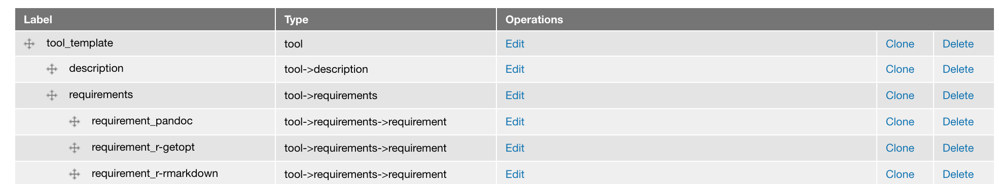
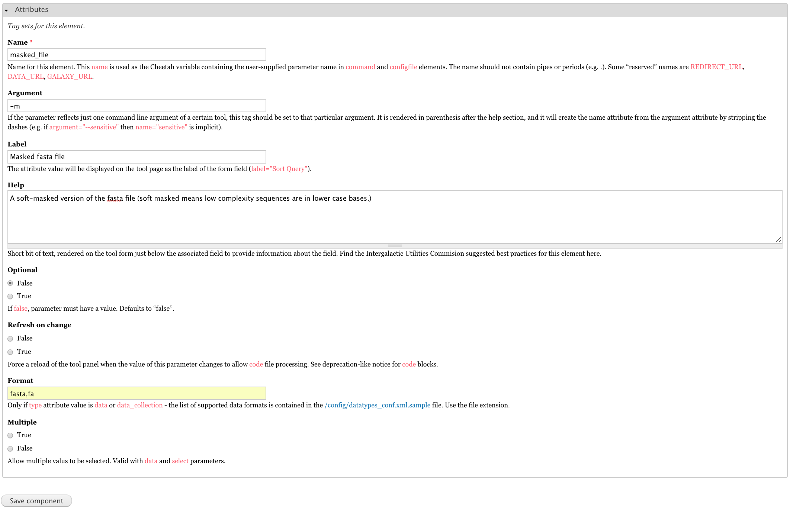
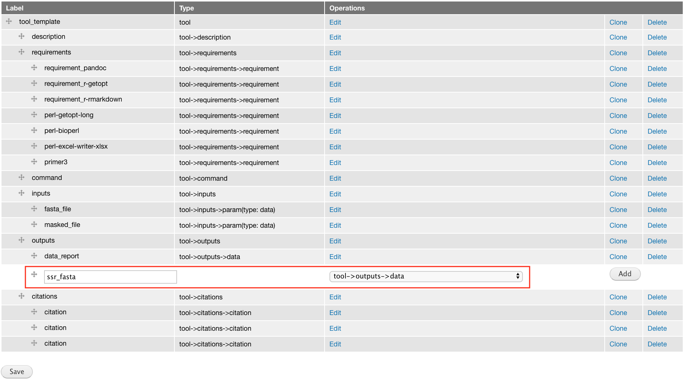
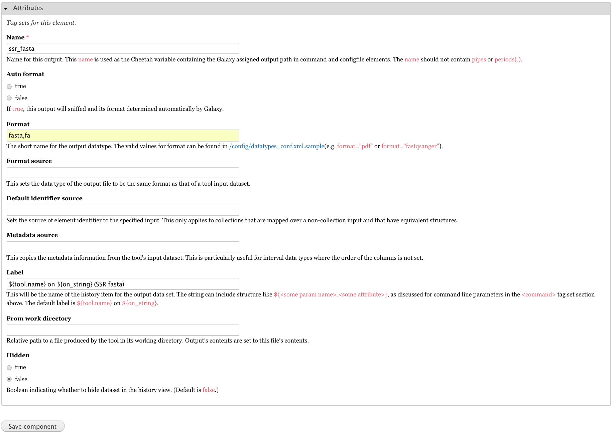
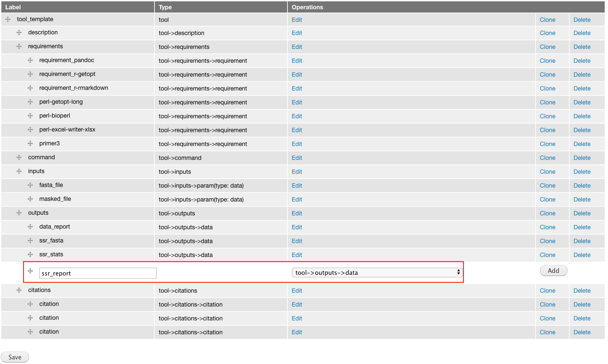
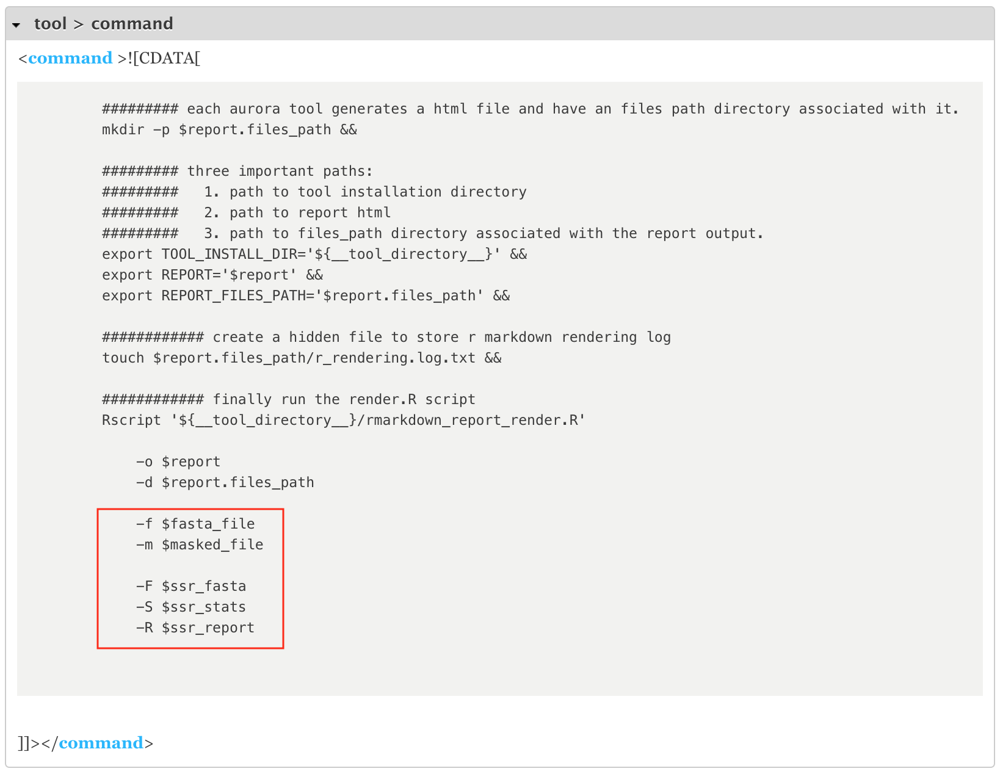
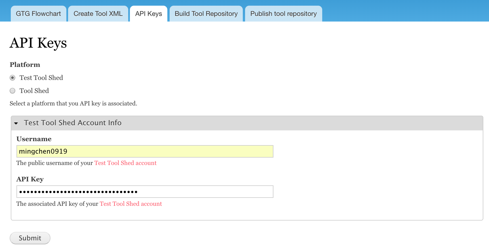
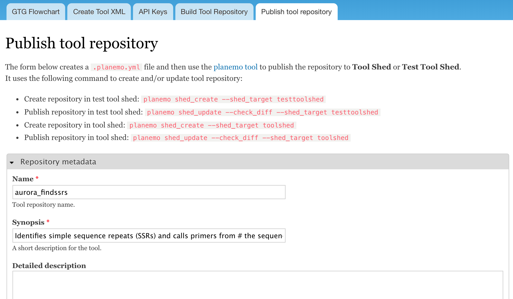
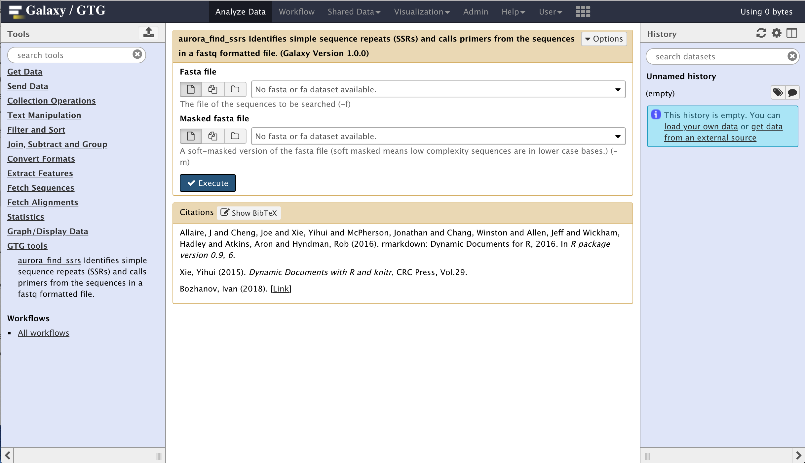

# The tool: Find-SRRs

The Find-SRRs tool is a perl script which can be found here: https://raw.githubusercontent.com/statonlab/Finding-SSRs/master/findSSRs_altered.pl. This instruction shows how to wrap this perl script into a Aurora Galaxy Tool.

# Launch GTG and Galaxy

Get a copy of `launch_dev_env.sh` to your local computer

```
wget https://raw.githubusercontent.com/MingChen0919/gtgdocker/master/launch_dev_env.sh
```

Run `launch_dev_env.sh`

```
sh launch_dev_env.sh
```

This will start the GTG app, a Galaxy instance, and creates a workspace with three folders within it.

```
gtg_dev_dir
├── database
├── galaxy_tool_repository
└── shed_tools
```

# Create initial XML

We will wrap `findSSRs_altered.pl` as an Aurora Galaxy Tool. 

* Click **Create Tool XML** and Fill the **XML file name** field with `rmarkdown_report.xml`
* Select Aurora Galaxy Tool and click **Save**


Edit the `tool` and `tool->description` components to give your tool a meaningful tool name and tool description.




# Add components to XML

## Add requirement components

This tool requires three perl modules - Getopt::Long, Bio::SeqIO, and Excel::Writer::XLSX - as well as Primer3. We create requirement component for each of these four components. We can find the dependencies and their version numbers in [bioconda](https://anaconda.org/bioconda/repo).

* perl-getopt-long (2.50)
* perl-bioperl (1.7.2)
* perl-excel-writer-xlsx (0.98)
* primer3 (2.4.1a)


## Add input components

The `Find SRRs` only has two inputs. We create input component for each.

```
# Usage: findSSRs.pl <arguments>
#
# The list of arguments includes:
#
# -f|--fasta_file <fasta_file>
# Required.  The file of the sequences to be searched.
#
# -m|--masked_file <masked_fasta_file>
# Required.  A soft-masked version of the fasta file (soft masked means low
# complexity sequences are in lower case bases.)
```

### The `fasta_file` input

Add a **tool->inputs->param(type: data)** component because this input takes a file path.


Edit input attributes


### The `masked_file` input

Add a **tool->inputs->param(type: data)** component because this input takes a file path.


Edit input attributes




## Add output components

Since we are building an Aurora Galaxy Tool, the tool report will provide access to all tool outputs. However,
if we want to expose some outputs to the Galaxy history so that it can be used as inputs for other tools, we will
need to create output components for those outputs.

Below is what this program outputs:

```
# Output:
# ------
# <input-file-name>.ssr.fasta
# A fasta file with sequences with a SSR. (Sequences with compound SSRs are included)
#
# <input-file-name>.ssr_stats.txt
# A text file of statistics about the SSRs discovered.
#
# <input-file-name>.ssr_report.txt
# A tab-delimited file with each SSR.  The columns are SSR ID,
# motif, number of repeats, start position, end position.
#
# <input-file-name>.ssr_report.xlsx
# A excel file with SSR results and stats
#
# <input-file-name>.di_primer_report.txt
# <input-file-name>.tri_primer_report.txt
# <input-file-name>.tetra_primer_report.txt
# Tab-delimited files with sequences with a specified SSR motif length.  Columns are
# SSR ID, motif, number of repeats, start position, end position, left primer,
# right primer, left primer Tm, right primer Tm, amplicon size
```

In this Galaxy tool, I choose to expose the following three outputs to the Galaxy history:
* `<input-file-name>.ssr.fasta`
* `<input-file-name>.ssr_stats.txt`
* `<input-file-name>.ssr_report.txt`


### The `ssr_fasta` output


Add a **tool->outputs->data** component.



Edit output attributes



### The `ssr_stats` output


Add a **tool->outputs->data** component.


Edit output attributes


### The `ssr_report` output


Add a **tool->outputs->data** component.



Edit output attributes


## Edit XML command section

We edit the shell script within the command section. In Aurora Galaxy Tools, this shell script is only used to collect user inputs and any command line arguments.


Instead of editing the shell script directly through the component web form, we edit the shell
script through the `gtg_dev_dir/galaxy_tool_repository/rmarkdown_report.sh` file. The content of this file
will be automatically plugged into the command section when the XML page is being viewed.

Open `gtg_dev_dir/galaxy_tool_repository/rmarkdown_report.sh` and add the following content to the end of the file.

```
            -f $fasta_file
            -m $masked_file

            -F $ssr_fasta
            -S $ssr_stats
            -R $ssr_report
```

After completing the edit of `rmarkdown_report.sh` file, click the `View/Update XML` tab **twice** to integrate the updates. 


Below is the updated command section



# Edit `getopt.csv`

In Aurora Galaxy Tools, the `rmarkdown_report_render.R` script runs as a command line program. The main purpose of it is to pass user inputs
to `rmarkdown_report.Rmd` and render `rmarkdown_report.Rmd` to execute data analysis and generate analysis report. The `getopt.csv` is used to
specify the short and long flags/options accepted by `rmarkdown_report_render.R`.

Open `getopt.csv` and add the following content to the csv file.

```
short flag	argument mask	data type	variable name
o			1				character	report
d			1				character	report.files_path
f			1				character	fasta_file
m			1				character	masked_file
F			1				character	ssr_fasta
S			1				character	ssr_stats
R			1				character	ssr_report
```

The `short flag` and the `variable name` column should be the same as what you put in the command section. Details can be found here about 
how to specify options/flags: https://cran.r-project.org/web/packages/getopt/getopt.pdf.

**How to use the variables collected by `rmarkdown_report_render.R`?**


>Aurora Galaxy Tools passes the arguments with two options: one is a set of R variables stored in a list named `opt`; the other
is a set of environment variables. Variables are named in the format of `X_SHORT_FLAG`. For example, if I want to use the the
variable `$report.files_path` in an R code chunk, I can access it by `opt$X_d`. If I want to use it as a environment variable, I can
access it by `$X_d`.


# Edit `rmarkdown_report.Rmd`

The `rmarkdown_report.Rmd` is where all the analysis logic should go. First, you need to download the `findSSRs_altered.pl` script and place
it into the `gtg_dev_dir/galaxy_tool_repository` directory.

```
cd gtg_dev_dir/galaxy_tool_repository
wget https://raw.githubusercontent.com/statonlab/Finding-SSRs/master/findSSRs_altered.pl
```

Add the content below to the end of the `rmarkdown_report.Rmd` file.

<pre>
# Run `findSRRs_altered.pl`

* `${REPORT_FILES_PATH}`: the output directory that stores all analysis outputs.
* `${TOOL_INSTALL_DIR}`: the tool install directory where the `findSSRs_altered.pl` is located.
* `$X_f`: the path to the fasta file.
* `$X_m`: the path to the masked fasta file.

```{bash}
cd ${REPORT_FILES_PATH}
perl ${TOOL_INSTALL_DIR}/findSSRs_altered.pl \
  -f $X_f \
  -m $X_m
```
</pre>

# Publish tool to Test ToolShed

## Add Test ToolShed API key

GTG uses [planemo](https://planemo.readthedocs.io/en/latest/index.html) in the backend to publish tools to ToolShed, 
which requires ToolShed API keys. Below is the interface to add ToolShed API keys.



## Build Tool Repository

Once we complete building the XML file, we need to add it to the `gtg_dev_dir/galaxy_tool_repository`. 
Click **Build Tool Repository**, select `rmarkdown_report.xml` and then click `Update XMLs in galaxy_tool_directory folder`.

.

We also need to unzip the `vakata-jstree-3.3.5.zip` file within `gtg_dev_dir/galaxy_tool_repository` directory. After the file
is unzipped, we can delete the `vakata-jstree-3.3.5.zip` file.

## Publish tool

Below is the webform to publish the tool to ToolShed or Test ToolShed. Fill out the form with necessary tool meta data and 
then click `Publish to Test Tool Shed` to publish the tool to the Test ToolShed first.



# Test Tool in Galaxy

## Install Tool into Galaxy

Login to the connected Galaxy (http://127.0.0.1:8081/) with the `username` and `password` below:


* user: `admin@galaxy.org`
* password: `admin`

Click **admin->Search Tool Shed->Galaxy Test Tool Shed** and search for tool `aurora_findssrs` and install the tool.

## Test `aurora_findssrs`



# Sync tool in GTG to tool installed in Galaxy

## Link tool between GTG and Galaxy

Developing Galaxy tools is an iterative process. It's very likely that you need to update your XML file frequently. GTG allows you to test the updates easily by syncing the tool in GTG into the connected Galaxy instance. You will use the following interface to link the tool in GTG
with the same tool installed in Galaxy. The path to the tool can be found in the `gtg_dev_dir/shed_tools`. For example, in this case the path
would be `shed_tools/testtoolshed.g2.bx.psu.edu/repos/mingchen0919/aurora_findssrs/389ef73cf4e1/aurora_findssrs`. Enter this path to 
the `Path to a shed tool`.

Everytime you update your XML file, you will need to integrate the updates by selecting the `rmarkdown_report.xml` and 
click `Update XMLs in galaxy_tool_directory_folder`.


## Restart Galaxy instance

To have the updates in XML to take effect, you will also need to restart Galaxy instance. Use the following command to restart Galaxy 

```
docker exec -it gtg_galaxy sh -c 'supervisorctl restart galaxy:'
```

You expect to see the following stdout.

```
galaxy:galaxy_nodejs_proxy: stopped
galaxy:handler0: stopped
galaxy:handler1: stopped
galaxy:galaxy_web: stopped
galaxy:galaxy_nodejs_proxy: started
galaxy:galaxy_web: started
galaxy:handler0: started
galaxy:handler1: started
```


